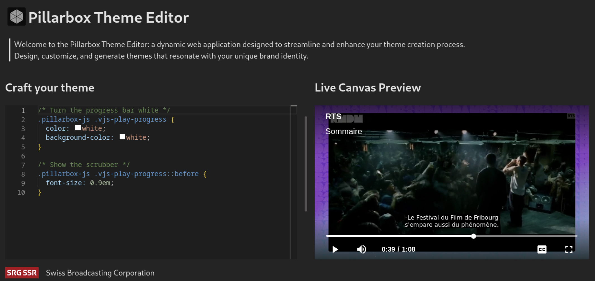

# Pillarbox-web Theme Editor

[](https://github.com/SRGSSR/pillarbox-web)

Welcome to the Pillarbox-web Theme Editor: a dynamic web application designed to streamline and
enhance your theme creation process for [pillarbox-web][pillarbox-web], a web SDK that supercharges
video.js with additional functionalities. With this editor, you're equipped to design, customize,
and generate themes that resonate with your unique brand identity, ensuring a cohesive and engaging
user experience across your video content.

Experience the latest version of the Theme Editor in action
here: https://srgssr.github.io/pillarbox-web-theme-editor/



## Quick Guide

### Prerequisites and Requirements

Ensure your system is equipped with:

- Node.js

### Setup

To get started with the Theme Editor on your local machine, follow these steps:

1. Configure the `@srgssr` registry in your `.npmrc` file:

    ```text
    //npm.pkg.github.com/:_authToken=TOKEN
    @srgssr:registry=https://npm.pkg.github.com
    ```

   Generate an authentication token by following this
   guide: [Authenticating with a personal access token][git-auth-token].

2. Clone the repository:

    ```shell
    git clone https://github.com/SRGSSR/pillarbox-web-theme-editor.git
    ```

3. Install dependencies:

    ```shell
    npm install
    ```

4. Launch the development server:

    ```shell
    npm run start
    ```

5. Navigate to `http://localhost:9696` in your browser.

   You'll be greeted by an intuitive interface featuring a CSS editor on the left and a live preview
   pane with a video player on the right, allowing for real-time theme customization.

## Documentation

The Pillarbox-web Theme Editor is crafted with pure JavaScript, employing [Lit][lit] for robust
component creation and the [Monaco Editor][monaco-editor] for an immersive CSS editing experience.
This setup ensures that users can directly engage with their theme's aesthetics through a powerful,
integrated development environment.

Built with [Vite][vite], the project prioritizes broad compatibility and performance, making it
readily accessible as a static page hosted on GitHub Pages.

## Contributing

If you want to contribute to the Theme Editor, you are welcome to do so. Please follow the code
style and linting rules defined in this project. You can use the following commands to check and fix
your code:

Check your javascript code:

```shell
npm run eslint
```

Check your CSS and SCSS code:

```shell
npm run stylelint
```

Fix your CSS and SCSS code:

```shell
npm run stylelint:fix
```

This project also has a pre-commit hook that runs the linting check automatically before you commit
your changes. You can enable this hook by running the `prepare` script: `npm run prepare`.

Before submitting a pull request, please make sure that your code builds successfully. You can use
the following commands to build the project:

```shell
npm run build
```

Please take note of our [Contribution Guide](CONTRIBUTING.md).

## License

This project is licensed under the MIT License. See the [LICENSE](../LICENSE) file for more details.

[pillarbox-web]: https://github.com/SRGSSR/pillarbox-web

[git-auth-token]: https://docs.github.com/en/packages/working-with-a-github-packages-registry/working-with-the-npm-registry#authenticating-with-a-personal-access-token

[lit]:https://lit.dev/

[monaco-editor]: https://github.com/microsoft/monaco-editor

[vite]: https://vitejs.dev/

